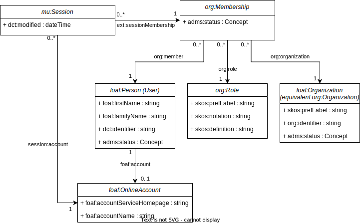

# Authenticatie

Aanmelden in Kaleidos gebeurt d.m.v. een integratie met ACM/IDM, het gebruikersbeheer- en authenticatiesysteem van de Vlaamse Overheid.

In het gebruikersbeheer van de VO kan aan gebruikers voor een bepaalde werkrelatie (= gebruiker als lid van een organisatie) toegang tot Kaleidos verleend worden in een bepaalde rol. Bij het aanmelden wordt deze informatie door ACM/IDM doorgegeven aan Kaleidos in de vorm van OAuth claims. De integratie is geïmplementeerd in de [acmidm-login-service](https://github.com/kanselarij-vlaanderen/acmidm-login-service).

## Data model

De informatie wordt in Kaleidos opgeslagen volgens onderstaand data model.

De werkrelatie wordt gecapteerd via een `org:Membership` die een gebruiker (`foaf:Person`) als lid van een bepaalde organizatie (`foaf:Organization`) in een bepaalde rol (`org:Role`) voorstelt. Iedere gebruiker heeft ook een account (`foaf:OnlineAccount`).

Bij de eerste aanmelding wordt een persoon, account, membership en organization resource aangemaakt indien deze nog niet bestaan.

De verschillende rollen zijn statisch ingeladen in Kaleidos als codelijst. De `skos:notation` van een rol bevat de mapping naar de rol zoals die doorgegeven wordt vanuit ACM/IDM.

Bij het aanmelden wordt de huidige mu-session gelinkt aan de account (`foaf:OnlineAccount`) en aan de werkrelatie (`org:Membership`) waarmee de gebruiker inlogt. Op ieder moment kan de gebruiker maar voor één werkrelatie gelijk ingelogd zijn in Kaleidos. Deze keuze wordt gemaakt tijdens het aanmeldingsproces van ACM/IDM.

## Mapping met ACM/IDM claims

De informatie uit ACM/IDM claims wordt in Kaleidos overgenomen volgens onderstaande mapping:

| Claim                 | Resource             | Property           |
|-----------------------|----------------------|--------------------|
| `given_name`          | `foaf:Person`        | `foaf:firstName`   |
| `family_name`         | `foaf:Person`        | `foaf:familyName`  |
| `vo_id`               | `foaf:Person`        | `dct:identifier`   |
| `sub`                 | `foaf:OnlineAccount` | `foaf:accountName` |
| `vo_orgcode`          | `foaf:Organization`  | `org:identifier`   |
| `vo_orgnaam`          | `foaf:Organization`  | `skos:prefLabel`   |
| `dkb_kaleidos_rol_3d` | `org:Role`           | `skos:notation`    |

