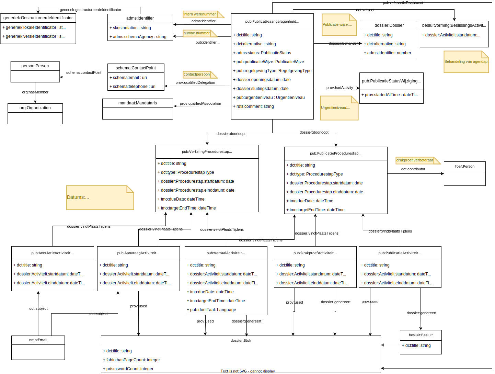

# Publication flow

De publication flow omvat het proces om besluiten te publiceren in het Belgisch Staatsblad. Zo’n besluit kan het resultaat zijn van een besluitvormingsaangelegenheid van de VR of aangeleverd worden via een andere weg.

De publication flow gaat uit van [ondertekende documenten](./signing-flow.md) als startpunt. De hele handteken-procedure wordt daarom onafhankelijk gezien van de publication flow.

De publication-flow valt buiten de scope van het OSLO Besluitvorming AP. Er zijn echter wel gelijkenissen en raakpunten. Waar mogelijk worden concepten uit het Besluitvorming AP en gerelateerde APs gebruikt. Deze worden aangevuld met nieuw gedefinieerde concepten in de `pub`-namespace (`http://mu.semte.ch/vocabularies/ext/publicatie/`).

# Publicatieaangelegenheid
Naar analogie met de `besluitvorming:Besluitvormingsaangelegenheid` (die leidt tot een besluit) wordt in de publication-flow een `pub:Publicatieaangelegenheid` (die leidt tot een publicatie) als main resource gezien. De publicatieaangelegenheid is de kapstok waar alles aanhangt.

Een publicatieaangelegenheid is gelinkt aan een dossier via `dossier:behandelt`. In het geval het een publicatie via de MR betreft, is dit hetzelfde dossier als de besluitvormingsaangelegenheid. In het andere geval wordt er een nieuw dossier gemaakt op het moment dat de publicatieaangelegenheid gemaakt wordt. De relatie is 1-to-many: een publicatieaangelegenheid hoort bij één dossier, maar een dossier kan leiden tot meerdere publicatieaangelegenheden.

Bij het opstarten van een nieuwe publicatieaangelegenheid wordt de openingsdatum (`dossier:openingsdatum`) op de huidige datum/tijd ingesteld. De titel (`dct:title`) en korte titel (`dct:alternative`) worden overgenomen van de besluitsvormingsaangelegenheid indien die er is. Eens opgestart kan de titel van de publicatieaangelegenheid gewijzigd worden zonder dat de titel van de bijhorende besluitvormingsaangelegenheid wijzigt.

Sommige eigenschappen van de publicatieaangelegenheid hebben betrekking op het doeldocument van de publication-flow (vb. type regelgevend document, wijze van publicatie). Momenteel zijn deze rechtstreeks op publicatieaangelegenheid gedefinieerd, maar mogelijk willen we hier in de toekomst toch een aparte resource voor definiëren.

Opmerkingen:
* Het splitsen van dossier en besluitvormingsaangelegenheid in de huidige implementatie valt buiten de scope van de publicatieflow
* Het splitsen van beslissingsactiviteit en behandeling van agendapunt in de huidige implementatie valt buiten de scope van de publicatieflow.
* Mogelijk willen we in de toekomst voor publicaties die opgestart worden niet vanuit een MR toch een beperkte historiek van de besluitvormingsaangelegenheid bijhouden

Voor een publicatieaangelegenheid die opgestart wordt vanuit een MR wordt een selectie van documenten (`dossier:Stuk`) vanop het agendapunt aangeduid als 'referentie'-document (via `pub:referentieDocument`). Dit document is het eigenlijke besluit waartoe het dossier geleid heeft, dat gepubliceerd wordt. Op lange termijn kan mogelijks automatisch afgeleid worden welk van de documenten uit het dossier het referentiedocument is.

# Publicatie status
Een publicatieaangelegenheid kent verschillende statussen:
* te publiceren
* gepauzeerd
* afgevoerd
* gepubliceerd

Deze worden voornamelijk gebruikt voor interne workflow doeleinden.

Elk van de statussen is een `skos:Concept` die deel uitmaken van eenzelfde `skos:ConceptScheme` via `skos:inScheme`.

Om publicaties te kunnen opvolgen wil men de datum van de laatste statuswijziging bijhouden. Dit gebeurt via een `pub:PublicatieStatusWijziging < prov:Activity`. Momenteel wordt enkel de laatste wijzing bijgehouden. De eigenschap `prov:startedAtTime` bevat het tijdstip van de wijziging. De `pub:PublicatieStatusWijziging` is via `prov:hadActivity` gerelateerd aan de publicatieaangelegenheid. Op ieder moment bevat de `pub:PublicatieStatusWijziging` die gerelateerd is aan de publicatieaangelegenheid het tijdstip waarop de huidige status van de publicatieaangelegenheid gezet is.

Wanneer de status gewijzigd wordt naar afgevoerd of gepubliceerd, betekent dit ook dat de een sluitingsdatum (`dossier:sluitingsdatum`) gezet wordt alsook de einddatum (`dossier:Procedurestap.einddatum`) op de bijhorende procedurestappen indien deze nog niet ingevuld zijn.

# Procedure
Iedere publication flow omvat volgende, vaste procedurestappen:
1. Vertaling
2. Publicatie

Elk van de procedurestap types is een `skos:Concept` die deel uitmaakt van eenzelfde `skos:ConceptScheme` via `skos:inScheme`. Voor ieder type wordt ook een expliciete subclass aangemaakt zodanig dat in de overzichtstabel van publicaties kan gesorteerd worden op een property van een van beide procedurestappen (vb. uiterste datum publicatie). Het type (`dct:type`) is dus fixed voor iedere subclass.

Bij het aanmaken van een publication flow worden de 2 procedurestappen automatisch aangemaakt met als startdatum (`dossier:Procedurestap.startdatum`) dezelfde datum als de openingsdatum van de publicatieaangelegenheid.

In uitbreiding van de procedurestap uit het OSLO Besluitvorming AP kan er bij iedere procedurestap ook gezet worden:
* verwachte datum (`tmo:targetEndDate`)
* vereiste datum (`tmo:dueDate`)

Deze datums geven een streefdatum voor de hele procedurestap. Op een activiteit van de procedurestap kan een specifiekere datum voor die ene activiteit gezet worden.

## Vertaling-procedurestap
De vertaling-procedurestap kan volgende activiteiten omvatten:
- aanvraag (`pub:AanvraagActiviteit`): het versturen van een aanvraag (via mail) om een document te vertalen
- vertaling (`pub:VertaalActiviteit`): het vertalen van een document
- annulatie (`pub:AnnulatieActiviteit`): het intrekken/annuleren van een vertaalaanvraag

Elk van de activiteiten is een subclass van `prov:Activity`. Naar analogie met de activiteiten binnen de besluitvormingsaangelegenheid, worden de subclasses expliciet gedefinieerd in de implementatie. Eventueel in de toekomst, wanneer mu-cl-resources inheritance ondersteunt, kan er gewerkt worden met een superclass die alle gemeenschappelijke eigenschappen bevat.

De activiteiten komen steeds in paren voor. Voor iedere taal waarvoor een vertaling moet gebeuren, wordt een aanvraag-activiteit en automatisch een bijhorende vertaling-activiteit gemaakt. De activiteiten zijn gekoppeld aan elkaar via `prov:wasInformedBy`. In praktijk wordt momenteel steeds slechts naar 1 taal vertaald, nl. Frans. We voorzien echter de flexibiliteit in het data model dat dit meerdere talen (en dus meerdere aanvraag- en vertaalactiviteiten) kunnen zijn in de toekomst.

Voor een vertaling kan ook een correctie/aanvulling gevraagd worden. Dit resulteert in een nieuwe aanvraag- en vertaalactiviteit binnen de vertaling-procedurestap.

### Aanvraag-activiteit
Aan een aanvraag-activiteit van een vertaling worden de te vertalen documenten gekoppeld. Bij het opstellen van een vertaalaanvraag dienen de mensen van OVRB de te vertalen documenten te uploaden. Deze documenten zijn, in het geval van een publicatie vanuit een MR, licht aangepast versies van de referentiedocumenten. Verder is er de mogelijkheid tot aanpassing van de notificatie-e-mail (`nmo:Email`) en invoer van de limiet van de vertaling (=uiterste veraaldatum) (`tmo:dueDate`) voor de vertaalactivitieit (`pub:VertaalActiviteit`).

De aanvraag-activiteit is een instant activiteit. De start- en einddatum worden daarom op hetzelfde tijdstip ingesteld.

De geselecteerde documenten om te vertalen zijn het eindresultaat (`dossier:genereert`) van de aanvraag-activiteit en tevens de bron (`prov:used`) van de vertaalactiviteit.

### Vertaalactiviteit
Wanneer het vertaalde document ontvangen wordt, wordt het als resultaat (`dossier:genereert`) aan de vertaling-activiteit gekoppeld en toegevoegd als stuk aan het dossier. Er wordt een einddatum op de vertaalactiviteit gezet.

**TODO**: link tussen origineel document en vertaald stuk?, taal toevoegen aan stuk?

## Publicatie-procedurestap
De publicatie-procedurestap kan volgende activiteiten omvatten:
- aanvraag (`pub:AanvraagActiviteit`): het versturen van een aanvraag (via mail) naar het BS om een drukproef of publicatie voor een document te maken
- drukproef (`pub:DrukproefActiviteit`): het maken van een drukproef voor een document
- publicatie (`pub:PublicatieActiviteit`): publicatie van een goedgekeurde drukproef in het BS

Elk van de activiteiten is een subclass van `prov:Activity`. Naar analogie met de activiteiten binnen de besluitvormingsaangelegenheid, worden de subclasses expliciet gedefinieerd in de implementatie. Eventueel in de toekomst, wanneer mu-cl-resources inheritance ondersteunt, kan er gewerkt worden met een superclass die alle gemeenschappelijke eigenschappen bevat.

De activiteiten komen steeds in paren voor. Voor iedere drukproef, wordt een aanvraag-activiteit en automatisch een bijhorende drukproef-activiteit gemaakt. Ook bij publicatie, wordt een aanvraag-activiteit en automatisch een bijhorende publicatie-activiteit gemaakt. De activiteiten zijn gekoppeld aan elkaar via `prov:wasInformedBy`.

Sequentieel bevat de publicatie-procedurestap volgende activiteiten paren:
- aanvraag/drukproef (kunnen er ook meerdere zijn)
- aanvraag/publicatie

### Aanvraag-activiteit
Aan een aanvraag-activiteit van een drukproef worden de te proefdrukken documenten gekoppeld. Bij het opstellen van een drukproef-aanvraag worden de documenten uit de vertaalstap automatisch toegevoegd. Dit zijn zowel de te vertalen als de vertaalde documenten. Indien gewenst kan de medewerker van OVRB deze terug uit de aanvraag halen. Daarnaast kan die tijdens deze stap documenten uploaden. Deze documenten worden zowel aan de aanvraag-activieit (`prov:used`) als aan de drukproef-activiteit toegevoegd (`prov:used`). Verder is er de mogelijkheid tot aanpassing van de notificatie-e-mail (`nmo:Email`). 

Aan een aanvraag-activiteit van een publicatie worden de te publiceren documenten gekoppeld. Bij het opstellen van een publicatie-aanvraag worden de ontvangen documenten uit de drukproefstap toegevoegd. Indien gewenst kan de medewerker van OVRB deze terug uit de aanvraag halen. Daarnaast kan die tijdens deze stap documenten uploaden. Deze documenten worden zowel aan de aanvraag-activieit (`prov:used`) als aan de drukproef-activiteit toegevoegd (`prov:used`). Verder is er de mogelijkheid tot aanpassing van de notificatie-e-mail (`nmo:Email`).

### Drukproef-activiteit
Wanneer het drukproef document ontvangen wordt, wordt het als resultaat (`dossier:genereert`) aan de drukproef-activiteit gekoppeld en toegevoegd als stuk aan het dossier. Er wordt een einddatum op de drukproef-activiteit gezet.

### Publicatie-activiteit
Het gepubliceerde besluit (`eli:LegalResource`) kan op twee manieren worden geregistreerd. De gebruiker kan deze manueel invoeren of deze kan automatisch zijn uitgelezen uit het Staatsblad.
Dit besluit wordt als resultaat (`dossier:genereert`) aan de publicatie-activiteit gekoppeld. Er wordt een einddatum op de publicatie-activiteit en op de publicatie-procedurestap gezet. Deze datum is tevens de publicatiedatum van het besluit.

## Activiteiten
Iedere aanvraag-activiteit gebruikt (`prov:used`) stukken. Deze worden als bijlage toegevoegd aan de notificatie-e-mail die verstuurd wordt. Elke gerelateerde activiteit (zowel vertaal-, drukproef- als publicatie-activiteit) gebruikt (`prov:used`) dezelfde stukken als de aanvraag-activiteit. De ontvangen stukken worden gelinkt aan de activiteit via `dossier:genereert`. In het geval van de publicatie-activiteit wordt de publicatie geregistreerd als een besluit (`eli:LegalResource`).

Totdat inheritance ondersteund wordt in mu-cl-resources worden voor de relatie tussen de procedurestappen en verschillende types activiteit custom subpredicates van `dossier:vindtPlaatsTijdens` gebruikt. Om het onderscheid te maken zit het type activiteit vervat in het predicate, bijvoorbeeld `pub:aanvraagVindtPlaatsTijdens`, `pub:vertalingVindtPlaatsTijdens`, ... Een analoge redenering is van toepassing voor de praktische implementatie van de relatie `prov:wasInformedBy` tussen activiteiten onderling.

# Opstarten van een publication-flow
## Vanuit een MR
In het geval een publication-flow opgestart wordt vanuit een MR worden volgende relaties bijgehouden:
- link naar het document (`dossier:Stuk`) via `pub:referentieDocument`
- link naar het dossier van de besluitvormingsaangelegenheid via `dossier:behandelt`
- link naar de beslissing (`besluitvorming:BeslissingsActiviteit`) via `dct:subject`. Aangezien `besluitvorming:BeslissingsActiviteit` en `besluit:BehandelingVanAgendapunt` momenteel nog 1 entiteit zijn in de huidige implementatie wordt de relatie gelegd naar `besluit:BehandelingVanAgendapunt`.

## Niet via MR
In het geval een publication-flow opgestart wordt niet via een MR wordt er een nieuw dossier (`dossier:Dossier`) en bijhorende beslissingsactiviteit gemaakt op het moment dat de publicatieaangelegenheid gemaakt wordt. De gebruiker kan vrij een titel (`dct:title`) en korte titel (`dct:alternative`) ingeven. Deze worden zowel op het dossier als op de publicatieaangelegenheid ingesteld. Tevens kan een datum van de beslissing ingevuld worden die ingesteld wordt als startdatum (`dossier:Activiteit.startdatum`) van de beslissingsactiviteit.

Mogelijk willen we in de toekomst voor publicaties die opgestart worden niet vanuit een MR toch een beperkte historiek van de besluitvormingsaangelegenheid bijhouden.

# Identificatoren
Een publication-flow heeft verschillende identificatoren:
- intern werkingsnummer
- numac nummer ontvangen van BS na aanvraag van een drukproef

Beiden worden gemodelleerd als `adms:Identifier` resource, maar omwille van implementatie-beperkingen van mu-cl-resources wordt het intern werkingsnummer gelinkt via `adms:identifier`, terwijl voor het numac-nummer een custom subproperty `pub:identifier < adms:identifier` gebruikt wordt.

## Intern werkingsnummer
Het intern werkingsnummer is gestructureerd. De structuur wordt gecapteerd met `generiek:GestructureerdeIdentificator`. Het is gerelateerd aan de `adms:Identifier` via `generiek:gestructureerdeIdentificator`. De structuur  is 2-ledig en bestaat uit:
- uniek nummer: `generiek:lokaleIdentificator`
- versie (bis, tris, ...): `generiek:versieIdentificator`

De eigenschap `skos:notation` van de `adms:Identifier` bevat de samengestelde identifier. Deze wordt door de frontend in sync gehouden met de waarden van de gestructureerde identificator.

## Numac nummer
Het numac nummer is een eigenschap die eigenlijk bij het besluit hoort dat gepubliceerd wordt in het BS als resultaat van de publication-flow. Aangezien deze besluit resource nog niet voorhanden is bij het aanvragen van de drukproef en het numac-nummer actief gebruikt wordt door OVRB tijdens het opvolgen van publicaties, wordt het numac-nummer ook bijgehouden als eigenschap van de publicatieaangelegenheid via `pub:identifier`.

# Publicatie
Het eindresultaat van een publication-flow is een gepubliceerd besluit in het BS. Dit is een legale verschijningsvorm (`eli:LegalExpression`) van de rechtsgrond (`eli:LegalResource`) die vervat zit in het besluit. De beslissingsfiche die opgeladen wordt bij een agendapunt van de MR is een andere legale verschijningsvorm van diezelfde rechtsgrond.

De structuur van de URL waarop de publicatie beschikbaar is in het BS volgt de [ELI richtlijnen](http://www.ejustice.just.fgov.be/eli/besluit/2020/06/11/2019031018/staatsblad). Vb. http://www.ejustice.just.fgov.be/eli/wet/2016/04/22/2016003166. Op basis van de data in Kaleidos kan deze URL geconstrueerd worden en automatisch gemonitord worden om te verifiëren of de aangevraagde publicatie effectief verschenen is. Indien de publicatie verschenen is, kan automatisch:
- de publicatiestatus aangepast worden naar gepubliceerd
- een sluitingsdatum gezet worden op de publicatieaangelegenheid
- een einddatum gezet worden op de publicatie-procedurestap
- een einddatum gezet worden op de publicatie-activiteit
- de ELI-conforme rechtsgrond URL koppelen aan het besluit-stuk in Kaleidos via `eli:realizes`.

# Mail notificaties
Voor de aanvraag- en annuleringactiviteiten wordt een notificatie via e-mail verstuurd vanuit de Kaleidos applicatie. Dit wordt gemodelleerd met `nmo:Email` volgens het data model van de [mail delivery service](https://github.com/redpencilio/deliver-email-service).

De e-mail wordt via `dct:subject` gelinkt aan de aanvraag- en annulatie-activiteit. In mu-cl-resources wordt de relatie enkel gespecifieerd van de activiteit naar de email.
