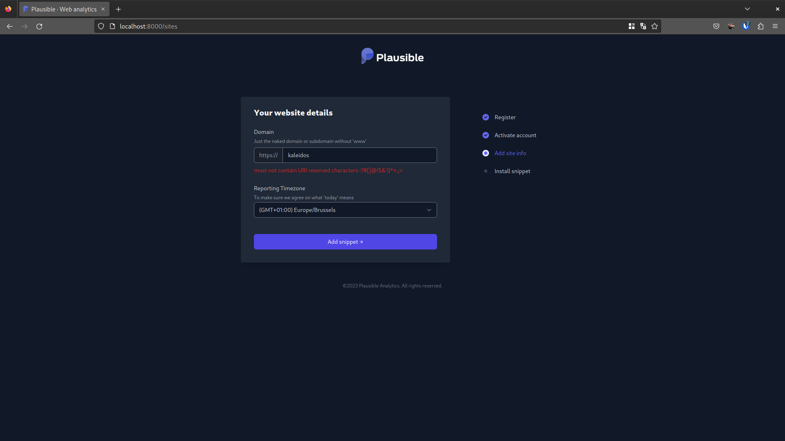
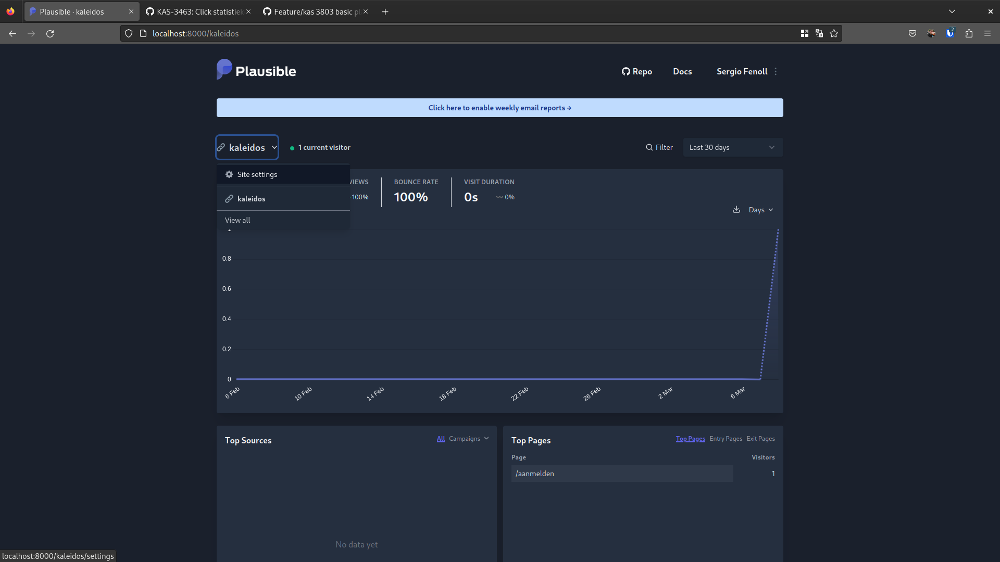
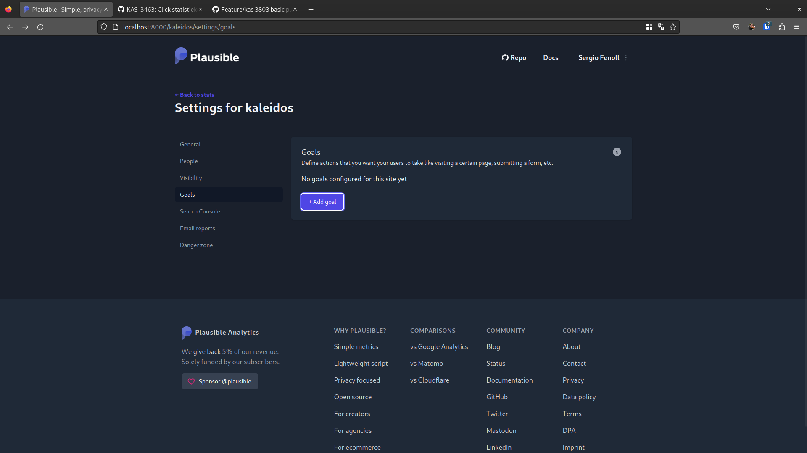
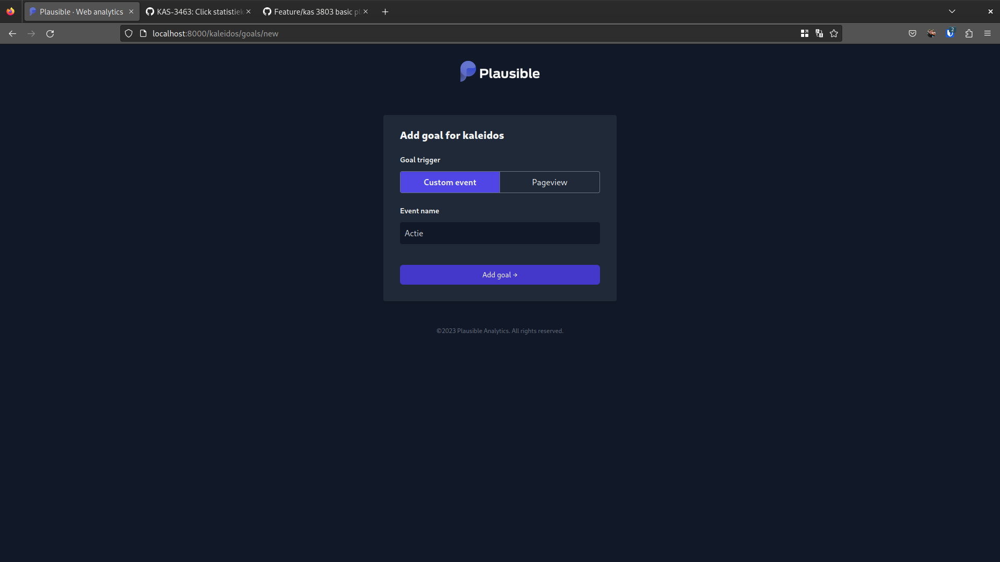

# Plausible: Data analytics

Binnen Kaleidos maken we gebruik van [Plausible](https://plausible.io/) om op een privacy-respecting manier data te tracken over het gebruik van de app.

## Handige links

- [Plausible docs](https://plausible.io/docs)
- [ember-plausible](https://github.com/redpencilio/ember-plausible): De add-on die we gebruiken om Plausible te integereren in onze Ember applicatie
- [plausible-click](https://github.com/kanselarij-vlaanderen/frontend-kaleidos/blob/development/app/modifiers/plausible-click.js): Ember modifier beschikbaar binnen Kaleidos die het versturen van custom events vergemakkelijkt

## Plausible lokaal opzetten

Als we nieuwe tracking elementen willen toevoegen aan Kaleidos is het noodzakelijk om tijdens de development fase deze te kunnen testen. Het is mogelijk om onze lokale dev instanties van Kaleidos te laten rapporteren aan de PROD Plausible instantie, maar dit is niet gewenst aangezien we dan de tracking data vervuilen.

Het is daarom wenselijk om lokaal een Plausible instantie op te zetten. Hiervoor kunnen we de [self-hosting tutorial](https://plausible.io/docs/self-hosting) van Plausible gebruiken. Die maakt gebruik van `docker compose` om een instantie op te zetten. Het is genoeg om stappen 1 tot en met 3 te volgen.

Eens de instantie draaiend is (by default op `http://localhost:8000` tenzij we `plausible-conf.env` aanpassen) kunnen we daar naartoe navigeren, waarna we een account moeten aanmaken. Plausible zal tijdens deze setup vragen naar de "website" details, geef hier in als domein `kaleidos`.



Nu moeten we nog de tracking enablen in onze Ember app, dit doen we door de 

```diff
diff --git a/app/instance-initializers/plausible.js b/app/instance-initializers/plausible.js
index 6ec9add..24a10b5 100644
--- a/app/instance-initializers/plausible.js
+++ b/app/instance-initializers/plausible.js
@@ -17,6 +17,7 @@ export function initialize(appInstance) {
       plausible.enable({
         domain,
         apiHost,
+        trackLocalhost: true,
       });
     }
   }
```

```diff
diff --git a/config/environment.js b/config/environment.js
index f99e7d5..0c04516 100644
--- a/config/environment.js
+++ b/config/environment.js
@@ -32,8 +32,8 @@ module.exports = function (environment) {
       enabled: false,
     },
     plausible: {
-      domain: '{{ANALYTICS_APP_DOMAIN}}',
-      apiHost: '{{ANALYTICS_API_HOST}}',
+      domain: 'kaleidos',
+      apiHost: 'http://localhost:8000',
     },
   };
 ```
 
 Na deze aanpassingen is onze app gereed om te communiceren met Plausible. Echter worden nu enkel de basis analytics getracked zoals pageviews. Als we custom events willen tracken moeten we nog custom goals toevoegen in Plausible. Dit doe je door te navigeren naar de site settings van `kaleidos`, daar doorklikken naar `Goals` en daar de nodige goals definiëren.
 
 
 
 
